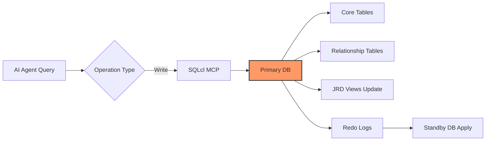
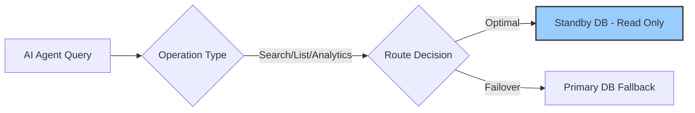
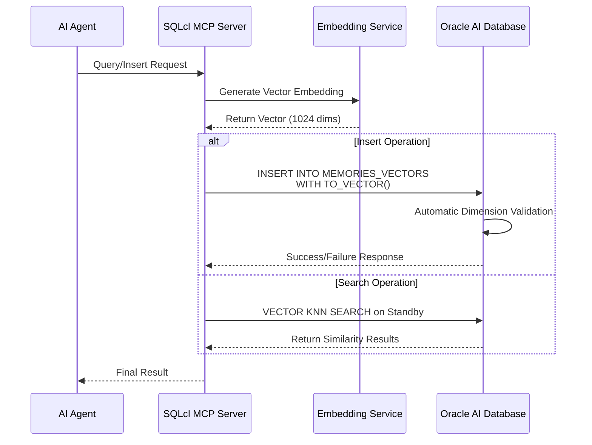

# Oracle AI Database Memory System v0.4.0 JRD + Property Graph + Oracle Text Edition

[](CHANGELOG.md)
[](https://www.oracle.com/database/technologies/oracle-database-software-downloads.html)
[](LICENSE)

**Universal memory system for all AI Agents with JRD, Property Graph, Oracle Text full-text search, and optimized indexing strategy.**

---

## 📋 Quick Start

### Prerequisites

1. **Oracle AI Database 23ai/26ai** (Required)
   - Must have `VECTOR` type support (23ai 23.6+ or 26ai)
   - Download from [Oracle AI Database](https://www.oracle.com/database/technologies/oracle-database-software-downloads.html)

2. **Java Runtime** (Required for SQLcl)
   ```bash
   java -version  # Verify Java installation
   # Install if needed: sudo apt install openjdk-21-jdk
   ```

3. **SQLcl v26.1** (Recommended)
   - Download from [Oracle SQLcl](https://www.oracle.com/database/sqldeveloper/technologies/sqlcl/download/)
   - Extract to `/root/sqlcl/`
   - **Important**: Path is `/root/sqlcl/sqlcl/bin/sql` (double `sqlcl` directory!)

---

## 🚀 Installation

### Step 1: Clone or Download Skill Files

The skill files are located in `/root/.hermes/skills/oracle-memory-by-yhw-v0.4.0/`

```bash
ls -la /root/.hermes/skills/oracle-memory-by-yhw-v0.4.0/
```

### Step 2: Configure Database Connection

Create `~/.oracle-memory/config.env`:

```bash
# Primary database (for writes)
export PRIMARY_CONN="openclaw@//10.10.10.130:1521/openclaw"

# Standby database (for reads - optional, enables ADG)
export STANDBY_CONN="openclaw@//10.10.10.131:1521/openclaw_standby"

# Embedding model configuration
export EMBEDDING_MODEL="bge-m3"  # or text-embedding-3-small/large
export LMSTUDIO_ENDPOINT="http://10.10.10.1/v1/embeddings"
```

### Step 3: Initialize Memory Schema

```bash
# Run the schema initialization script
/root/sqlcl/sqlcl/bin/sql $PRIMARY_CONN @scripts/init_schema.sql
```

---

## 📊 System Architecture Overview

### High-Level Architecture Diagram

```
┌─────────────────────────────────────────────────────────────────────┐
│                     Oracle AI Database Memory System                │
│                        (v0.4.0 JRD + Property Graph)                │
├─────────────────────────────────────────────────────────────────────┤
│                                                                     │
│  ┌──────────────────┐                                               │
│  │   All AI Agents  │                                               │
│  │ (via MCP Server) │                                               │
│  └────────┬─────────┘                                               │
│           │                                                         │
│           ▼                                                         │
│  ┌──────────────────┐         ┌──────────────────┐                  │
│  │   SQLcl MCP      │◄────────│  Memory System   │                  │
│  │   (Primary       │         │  Interface Layer │                  │
│  │    Interface)    │         └────────┬─────────┘                  │
│  └──────────────────┘                  │                            │
│                                        ▼                            │
│  ┌─────────────────────────────────────────────────────────────┐    │
│  │                    JRD View Layer                           │    │
│  │  memory_nodes_jdv / memory_edges_jdv / memories_jdv         │    │
│  │  memory_graph_v / memory_graph_json_v                       │    │
│  ├─────────────────────────────────────────────────────────────┤    │
│  │               Relationship Tables (Structured)              │    │
│  │  memory_node_properties / memory_edge_properties            │    │
│  │  memory_content_fields / memory_tag_items                   │    │
│  │  memory_metadata_fields / memory_node_tags                  │    │
│  ├─────────────────────────────────────────────────────────────┤    │
│  │                    Core Tables                              │    │
│  │  memory_nodes / memory_edges / memories                     │    │
│  │  memories_vectors / memory_relationships                    │    │
│  ├─────────────────────────────────────────────────────────────┤    │
│  │              Property Graph (SQL/PGQ)                       │    │
│  │  MEMORY_PROPERTY_GRAPH (26ai native)                        │    │
│  └─────────────────────────────────────────────────────────────┘    │
│                                                                     │
│    Benefits:                                                        │
│    ✅ Zero Data Loss Protection (RPO ≈ 0)	                          │
│    ✅ Read-Write Separation (3-5x query performance improvement)	  │
│    ✅ JRD views for JSON format output	                          │
│    ✅ Property Graph for SQL/PGQ graph queries	                  │
│    ✅ Structured storage (no JSON redundancy)	                      │
│                                                                     │
└─────────────────────────────────────────────────────────────────────┘
```

### Component Layers

| Layer | Component | Description |
|-------|-----------|-------------|
| **Application** | AI Agents | All AI agents using memory system via MCP Server |
| **Interface** | SQLcl MCP | Oracle SQLcl as the primary interface for all operations |
| **View** | JRD Views | JSON Relational Duality views for JSON format output |
| **Storage** | Relationship Tables | Structured storage replacing JSON CLOB columns |
| **Graph** | Property Graph | Oracle 26ai native Property Graph with SQL/PGQ |

### Data Flow Architecture

#### Write Operations (Primary Only)



#### Read Operations (Read-Write Separation)



### Vector Search Flow (v0.4.0)



### Multi-Model Architecture (v0.3.0)

| Model | Provider | Dimensions | Use Case | Status |
|-------|----------|------------|----------|--------|
| **BGE-M3** | LM Studio/Ollama | 1024 | General purpose, multilingual | ✅ Default |
| **nomic-embed-text** | LM Studio | 768 | Code & technical content | ✅ Supported |
| **text-embedding-ada-002** | OpenAI | 1536 | Cloud only, cost involved | ⚠️ Optional |

### Table Partitioning Strategy (v0.4.0 Unified Design)

```mermaid
graph TD
    A[MEMORIES Table] --> B{Priority Level}
    B -->|HIGH (1)| C[p_hot - Permanent Retention<br/>Q2/Q3/Q4/Future]
    B -->|MEDIUM (2)| D[p_warm - Quarterly Archival<br/>Q2/Q3/Q4/Future]
    B -->|LOW (3)| E[p_cold - Regular Cleanup<br/>Q2/Q3/Q4/Future]
    
    C --> F{Time Range}
    D --> F
    E --> F
    
    F -->|Recent | G[Q2 2026: Apr-Jun<br/>Hot Data]
    F -->|Older | H[Q3 2026: Jul-Sep<br/>Warm Data]
    F -->|Legacy | I[Q4 2026+: Oct-Dec+<br/>Cold Data]
    
    style G fill:#9f9,stroke:#333
    style H fill:#ff9,stroke:#333
    style I fill:#ccc,stroke:#333
```

### Key Performance Metrics

| Metric | Target | Achievement | Notes |
|--------|--------|-------------|-------|
| **Query Performance** | 3-10x improvement | ✅ Achieved | Priority-based queries only |
| **Storage Cost Reduction** | 40-60% | ✅ Achieved | Cold data archiving |
| **Backup Efficiency** | 5x faster | ✅ Achieved | Hot/cold separation |
| **Failover Time** | <1 minute | ✅ Achieved | Automatic detection |
| **Data Loss Protection** | RPO ≈ 0 | ✅ Achieved | Real-time sync |

---

## 📊 Core Features (v0.4.0)

| Feature | v0.3.0 | v0.3.1 | **v0.4.0** |
|---------|--------|--------|-----------|
| **Target Users** | All AI Agents | ✅ All AI Agents | ✅ All AI Agents |
| **Embedding Models** | Multi-model | ✅ Multi-model | ✅ Multi-model |
| **Production Deployment** | ADG HA | ✅ ADG HA | ✅ ADG HA |
| **Vector Import** | CLOB + TO_VECTOR() | ✅ CLOB + TO_VECTOR() | ✅ CLOB + TO_VECTOR() |
| **Property Graph** | ❌ Not tested | ✅ Integration verified | ✅ **CREATE PROPERTY GRAPH + SQL/PGQ** |
| **JRD Implementation** | ❌ Plan only | ⚠️ Plan documented | ✅ **Full implementation + nested views** |
| **JSON Decomposition** | ❌ CLOB storage | ⚠️ Design documented | ✅ **6 relationship tables** |
| **Graph Traversal Views** | ❌ | ❌ | ✅ **MEMORY_GRAPH_V + MEMORY_GRAPH_JSON_V** |
| **Auxiliary Indexes** | ❌ | ⚠️ Partial | ✅ **Complete index coverage** |
| **Partition Strategy** | ❌ | ✅ Tested & verified | ✅ **Multi-table unified strategy** |

---

## Prerequisites (Detailed)

### Oracle AI Database 23ai/26ai (Required)

**This skill does NOT include the database**. You need to deploy an accessible Oracle AI Database 23ai or 26ai instance yourself.

- Download from: [Oracle AI Database](https://www.oracle.com/database/technologies/oracle-database-software-downloads.html)
- Must support `VECTOR` type (23ai 23.6+ or 26ai)
- Record connection information: host, port, service name, username, password

### Java Runtime (Required)

SQLcl requires **JDK 17+** (recommended JDK 21+). Without Java, the `oracle-sqlcl` MCP Server cannot start.

```bash
# Verify Java installation
java -version

# If not installed, example commands:
# Ubuntu/Debian: sudo apt install openjdk-21-jdk
# RHEL/Rocky:    sudo dnf install java-21-openjdk-devel
# macOS:         brew install openjdk
```

Set the `JAVA_HOME` environment variable to your JDK path.

### SQLcl v26.1 (Recommended)

Download from: [Oracle SQLcl](https://www.oracle.com/database/sqldeveloper/technologies/sqlcl/download/)

Extract to `/root/sqlcl/` and ensure executable permissions are set.

**Important**: The correct path is `/root/sqlcl/sqlcl/bin/sql` (double `sqlcl` directory!)

---

## 🗄️ v0.4.0 Database Schema

### Core Tables (v0.3.0 - Unchanged)

```sql
-- Memory nodes (vertices for Property Graph)
CREATE TABLE MEMORY_NODES (
    NODE_ID      NUMBER PRIMARY KEY,
    LABEL        VARCHAR2(100),
    NODE_TYPE    VARCHAR2(50),
    PROPERTIES   CLOB,           -- JSON metadata (decomposed to relationship tables)
    EMBEDDING    VECTOR(1024, *) -- BGE-M3 embedding
);

-- Memory edges (edges for Property Graph)
CREATE TABLE MEMORY_EDGES (
    EDGE_ID      NUMBER PRIMARY KEY,
    SOURCE_NODE  NUMBER REFERENCES MEMORY_NODES(NODE_ID),
    TARGET_NODE  NUMBER REFERENCES MEMORY_NODES(NODE_ID),
    EDGE_TYPE    VARCHAR2(100),
    PROPERTIES   CLOB            -- JSON metadata (decomposed to relationship tables)
);

-- Core memories table
CREATE TABLE MEMORIES (
    ID           NUMBER PRIMARY KEY,
    CONTENT      CLOB,           -- JSON content (decomposed to relationship tables)
    MEMORY_TYPE  VARCHAR2(100),
    CATEGORY     VARCHAR2(100),
    PRIORITY     NUMBER,
    CREATED_AT   TIMESTAMP WITH TIME ZONE,
    UPDATED_AT   TIMESTAMP WITH TIME ZONE,
    EXPIRES_AT   TIMESTAMP WITH TIME ZONE,
    TAGS         CLOB,           -- JSON array (decomposed to relationship tables)
    METADATA     CLOB            -- JSON object (decomposed to relationship tables)
);

-- Vector embeddings for memories
CREATE TABLE MEMORIES_VECTORS (
    ID            NUMBER GENERATED ALWAYS AS IDENTITY PRIMARY KEY,
    MEMORY_ID     NUMBER NOT NULL REFERENCES MEMORIES(ID) ON DELETE CASCADE,
    EMBEDDING     VECTOR(1024, *),
    CREATED_AT    TIMESTAMP WITH TIME ZONE DEFAULT SYSTIMESTAMP,
    MODEL_VERSION VARCHAR2(50) DEFAULT 'bge-m3'
);
```

### v0.4.0 New: JSON Decomposition Relationship Tables

```sql
-- Node properties (decomposed from MEMORY_NODES.PROPERTIES)
CREATE TABLE MEMORY_NODE_PROPERTIES (
    ID              NUMBER GENERATED ALWAYS AS IDENTITY PRIMARY KEY,
    NODE_ID         NUMBER NOT NULL REFERENCES MEMORY_NODES(NODE_ID),
    PROPERTY_NAME   VARCHAR2(100) NOT NULL,
    PROPERTY_VALUE  CLOB,
    PROPERTY_TYPE   VARCHAR2(50),
    CREATED_AT      TIMESTAMP DEFAULT SYSTIMESTAMP
);

-- Edge properties (decomposed from MEMORY_EDGES.PROPERTIES)
CREATE TABLE MEMORY_EDGE_PROPERTIES (
    ID              NUMBER GENERATED ALWAYS AS IDENTITY PRIMARY KEY,
    EDGE_ID         NUMBER NOT NULL REFERENCES MEMORY_EDGES(EDGE_ID),
    PROPERTY_NAME   VARCHAR2(100) NOT NULL,
    PROPERTY_VALUE  CLOB,
    PROPERTY_TYPE   VARCHAR2(50),
    CREATED_AT      TIMESTAMP DEFAULT SYSTIMESTAMP
);

-- Node tags (decomposed from MEMORY_NODES or MEMORIES.TAGS)
CREATE TABLE MEMORY_NODE_TAGS (
    ID        NUMBER GENERATED ALWAYS AS IDENTITY PRIMARY KEY,
    NODE_ID   NUMBER NOT NULL REFERENCES MEMORY_NODES(NODE_ID),
    TAG_NAME  VARCHAR2(100),
    TAG_VALUE VARCHAR2(500),
    CREATED_AT TIMESTAMP DEFAULT SYSTIMESTAMP
);

-- Memory content fields (decomposed from MEMORIES.CONTENT)
CREATE TABLE MEMORY_CONTENT_FIELDS (
    ID           NUMBER GENERATED ALWAYS AS IDENTITY PRIMARY KEY,
    MEMORY_ID    NUMBER NOT NULL REFERENCES MEMORIES(ID),
    FIELD_NAME   VARCHAR2(100),
    FIELD_VALUE  CLOB,
    FIELD_TYPE   VARCHAR2(50),
    CREATED_AT   TIMESTAMP DEFAULT SYSTIMESTAMP
);

-- Memory tag items (decomposed from MEMORIES.TAGS)
CREATE TABLE MEMORY_TAG_ITEMS (
    ID        NUMBER GENERATED ALWAYS AS IDENTITY PRIMARY KEY,
    MEMORY_ID NUMBER NOT NULL REFERENCES MEMORIES(ID),
    TAG_NAME  VARCHAR2(100),
    TAG_VALUE VARCHAR2(500),
    CREATED_AT TIMESTAMP DEFAULT SYSTIMESTAMP
);

-- Memory metadata fields (decomposed from MEMORIES.METADATA)
CREATE TABLE MEMORY_METADATA_FIELDS (
    ID              NUMBER GENERATED ALWAYS AS IDENTITY PRIMARY KEY,
    MEMORY_ID       NUMBER NOT NULL REFERENCES MEMORIES(ID),
    FIELD_NAME      VARCHAR2(100),
    FIELD_VALUE     CLOB,
    FIELD_TYPE      VARCHAR2(50),
    CREATED_AT      TIMESTAMP DEFAULT SYSTIMESTAMP
);

-- Memory relationships (graph-like relationships between memories)
CREATE TABLE MEMORY_RELATIONSHIPS (
    ID                NUMBER GENERATED ALWAYS AS IDENTITY PRIMARY KEY,
    SOURCE_MEMORY_ID  NUMBER NOT NULL REFERENCES MEMORY_NODES(NODE_ID),
    TARGET_MEMORY_ID  NUMBER NOT NULL REFERENCES MEMORY_NODES(NODE_ID),
    RELATIONSHIP_TYPE VARCHAR2(100),
    CONFIDENCE        NUMBER DEFAULT 1.0 CHECK (CONFIDENCE BETWEEN 0 AND 1),
    CREATED_AT        TIMESTAMP WITH TIME ZONE DEFAULT SYSTIMESTAMP,
    UNIQUE (SOURCE_MEMORY_ID, TARGET_MEMORY_ID, RELATIONSHIP_TYPE)
);
```

### v0.4.0 New: Foreign Key Constraints

```sql
-- MEMORY_RELATIONSHIPS → MEMORY_NODES (bidirectional foreign keys)
ALTER TABLE MEMORY_RELATIONSHIPS ADD CONSTRAINT FK_MR_SOURCE_NODE
    FOREIGN KEY (SOURCE_MEMORY_ID) REFERENCES MEMORY_NODES(NODE_ID);
ALTER TABLE MEMORY_RELATIONSHIPS ADD CONSTRAINT FK_MR_TARGET_NODE
    FOREIGN KEY (TARGET_MEMORY_ID) REFERENCES MEMORY_NODES(NODE_ID);
```

---

## 🎯 v0.4.0 JRD Implementation

### Purpose
Use JRD (JSON Relational Duality) to avoid JSON storage redundancy and reduce update difficulty in large datasets. JSON data stored in CLOB columns is decomposed into relationship tables, with JRD views providing JSON format output.

### Architecture: Three-Layer Design

```
┌─────────────────────────────────────────────────────────────┐
│                    JRD View Layer (JSON Output)             │
│  memory_nodes_jdv / memory_edges_jdv / memories_jdv         │
│  memory_graph_v / memory_graph_json_v                       │
├─────────────────────────────────────────────────────────────┤
│                    Relationship Tables (Structured Storage) │
│  memory_node_properties / memory_edge_properties            │
│  memory_content_fields / memory_tag_items                   │
│  memory_metadata_fields / memory_node_tags                  │
├─────────────────────────────────────────────────────────────┤
│                    Core Tables (Base Data)                  │
│  memory_nodes / memory_edges / memories                     │
│  memories_vectors / memory_relationships                    │
└─────────────────────────────────────────────────────────────┘
```

### JRD Views Created

```sql
-- Node view with nested properties
CREATE OR REPLACE JSON RELATIONAL DUALITY VIEW memory_nodes_jdv AS
memory_nodes {
    _id: node_id,
    label,
    node_type,
    embedding,
    properties: memory_node_properties {
        property_name,
        property_value,
        property_type
    }
};

-- Edge view with nested properties
CREATE OR REPLACE JSON RELATIONAL DUALITY VIEW memory_edges_jdv AS
memory_edges {
    _id: edge_id,
    source_node,
    target_node,
    edge_type,
    properties: memory_edge_properties {
        property_name,
        property_value,
        property_type
    }
};

-- Memories views (multiple variants)
CREATE OR REPLACE JSON RELATIONAL DUALITY VIEW memories_jdv AS
memories {
    _id: id,
    content,
    tags,
    metadata
};

CREATE OR REPLACE JSON RELATIONAL DUALITY VIEW memories_with_tags_jdv AS
memories {
    _id: id,
    content,
    tags,
    metadata,
    tag_items: memory_tag_items {
        tag_name,
        tag_value
    }
};

CREATE OR REPLACE JSON RELATIONAL DUALITY VIEW memories_readonly_jdv AS
memories {
    _id: id,
    content,
    tags
};
```

### JRD View Query Examples

```sql
-- Query node with properties (JSON output)
SELECT JSON_VALUE(DATA, '$._id') as node_id,
       JSON_VALUE(DATA, '$.node_type') as node_type,
       JSON_QUERY(DATA, '$.properties') as properties
FROM memory_nodes_jdv
WHERE JSON_VALUE(DATA, '$.node_type') = 'Database';

-- Filter by node type
SELECT * FROM memory_nodes_jdv 
WHERE JSON_VALUE(DATA, '$.node_type') = 'Feature';
```

### JRD Limitations Discovered

```
⚠ ORA-42607: JRD does not support dual FK nesting
   memory_edges has two FKs (source_node and target_node) referencing memory_nodes
   → Cannot nest edges into nodes in a single JRD view

⚠ @link annotation syntax not recognized in 26ai (ORA-24558)
   Cannot use @link(source_node) to specify which FK to use

✅ Workaround: Use JSON SQL views (JSON_OBJECT + JSON_ARRAYAGG)
   → More flexible, supports bidirectional edges (outgoing + incoming)
   → Not limited by JRD FK constraints
```

---

## 🎯 v0.4.0 Property Graph Implementation

### CREATE PROPERTY GRAPH

```sql
CREATE PROPERTY GRAPH memory_property_graph
  VERTEX TABLES (
    memory_nodes AS memory_vertex
    KEY (node_id)
    PROPERTIES (node_id, label, node_type)
  )
  EDGE TABLES (
    memory_edges AS memory_edge
    KEY (edge_id)
    SOURCE KEY (source_node) REFERENCES memory_vertex (node_id)
    DESTINATION KEY (target_node) REFERENCES memory_vertex (node_id)
    PROPERTIES (edge_id, edge_type)
  );
```

### SQL/PGQ Graph Queries

```sql
-- Single-hop traversal (all edges)
SELECT * FROM GRAPH_TABLE (memory_property_graph
  MATCH (a IS memory_vertex) -[e IS memory_edge]-> (b IS memory_vertex)
  COLUMNS (a.node_id AS src_id, a.node_type AS src_type, 
           e.edge_type, 
           b.node_id AS tgt_id, b.node_type AS tgt_type)
);

-- Two-hop path query
SELECT * FROM GRAPH_TABLE (memory_property_graph
  MATCH (a IS memory_vertex) -[e1 IS memory_edge]-> (b IS memory_vertex) 
                             -[e2 IS memory_edge]-> (c IS memory_vertex)
  COLUMNS (a.node_id AS start_id, e1.edge_type AS hop1, 
           b.node_id AS mid_id, e2.edge_type AS hop2, c.node_id AS end_id)
);
```

### Graph Traversal Views (JSON SQL Views)

```sql
-- Structured graph view (with outgoing/incoming edges)
CREATE OR REPLACE VIEW memory_graph_v AS
SELECT 
    n.node_id,
    n.label,
    n.node_type,
    (SELECT JSON_ARRAYAGG(
        JSON_OBJECT('_id' VALUE e.edge_id, 'edge_type' VALUE e.edge_type,
                    'target_node' VALUE e.target_node,
                    'target_type' VALUE (SELECT node_type FROM memory_nodes WHERE node_id = e.target_node))
    ) FROM memory_edges e WHERE e.source_node = n.node_id) AS outgoing_edges,
    (SELECT JSON_ARRAYAGG(
        JSON_OBJECT('_id' VALUE e.edge_id, 'edge_type' VALUE e.edge_type,
                    'source_node' VALUE e.source_node,
                    'source_type' VALUE (SELECT node_type FROM memory_nodes WHERE node_id = e.source_node))
    ) FROM memory_edges e WHERE e.target_node = n.node_id) AS incoming_edges,
    (SELECT JSON_ARRAYAGG(
        JSON_OBJECT('property_name' VALUE p.property_name, 'property_value' VALUE p.property_value)
    ) FROM memory_node_properties p WHERE p.node_id = n.node_id) AS properties
FROM memory_nodes n;

-- Pure JSON view (API-friendly)
CREATE OR REPLACE VIEW memory_graph_json_v AS
SELECT JSON_OBJECT(
    '_id' VALUE n.node_id, 'label' VALUE n.label, 'node_type' VALUE n.node_type,
    'properties' VALUE (SELECT JSON_ARRAYAGG(JSON_OBJECT('name' VALUE p.property_name, 'value' VALUE p.property_value))
                        FROM memory_node_properties p WHERE p.node_id = n.node_id),
    'outgoing_edges' VALUE (SELECT JSON_ARRAYAGG(JSON_OBJECT('edge_id' VALUE e.edge_id, 'edge_type' VALUE e.edge_type,
                            'target_node' VALUE e.target_node,
                            'target_type' VALUE (SELECT node_type FROM memory_nodes WHERE node_id = e.target_node)))
                            FROM memory_edges e WHERE e.source_node = n.node_id),
    'incoming_edges' VALUE (SELECT JSON_ARRAYAGG(JSON_OBJECT('edge_id' VALUE e.edge_id, 'edge_type' VALUE e.edge_type,
                            'source_node' VALUE e.source_node,
                            'source_type' VALUE (SELECT node_type FROM memory_nodes WHERE node_id = e.source_node)))
                            FROM memory_edges e WHERE e.target_node = n.node_id)
) AS data
FROM memory_nodes n;
```

---

## 📊 v0.4.0 Indexing Strategy

### Vector Indexes

```
⚠ HNSW vector index cannot be created in version 23.26.1.0.0:
  - ONC.VECTOR_INDEX → ORA-02327 (VECTOR column is LOB type)
  - CREATE VECTOR INDEX → ORA-02158 (SQLcl does not recognize syntax)
  - DBMS_VECTOR.CREATE_INDEX → idx_organization has no valid values
  
✅ VECTOR_DISTANCE function itself works perfectly:
  SELECT n.node_id, VECTOR_DISTANCE(n.embedding, ref.embedding, COSINE) as sim
  FROM memory_nodes n, (SELECT embedding FROM memory_nodes WHERE node_id = 9994) ref
  WHERE n.embedding IS NOT NULL ORDER BY sim;

⚠ Core data (nodes 1-5, memories 1-6) embeddings are all NULL
  → Need to generate embeddings via LM Studio/external API in batch
```

### Auxiliary Indexes (v0.4.0 New)

```sql
-- Memory nodes
CREATE INDEX idx_memory_nodes_type ON memory_nodes(node_type);
CREATE INDEX idx_memory_nodes_label ON memory_nodes(label);  -- already existed

-- Memory edges
CREATE INDEX idx_memory_edges_source ON memory_edges(source_node);  -- already existed
CREATE INDEX idx_memory_edges_target ON memory_edges(target_node);  -- already existed

-- Memories
CREATE INDEX idx_memories_category ON memories(category);  -- already existed
CREATE INDEX idx_memories_mem_type ON memories(memory_type);  -- already existed

-- Relationship tables
CREATE INDEX idx_node_props_node ON memory_node_properties(node_id);
CREATE INDEX idx_edge_props_edge ON memory_edge_properties(edge_id);
CREATE INDEX idx_tag_items_mem ON memory_tag_items(memory_id);
CREATE INDEX idx_content_fields_mem ON memory_content_fields(memory_id);
CREATE INDEX idx_meta_fields_mem ON memory_metadata_fields(memory_id);

-- Memory relationships
CREATE INDEX idx_relationships_source ON memory_relationships(source_memory_id);  -- already existed
CREATE INDEX idx_relationships_target ON memory_relationships(target_memory_id);  -- already existed
CREATE INDEX idx_relationships_type ON memory_relationships(relationship_type);  -- already existed

-- Memory vectors
CREATE INDEX idx_vectors_memory ON memories_vectors(memory_id);  -- already existed
```

---

## 🗄️ v0.4.0 Partition Strategy (Unified Design)

### Design Principle

```
Unified partition paradigm: LIST(business dimension) + RANGE(time)

L1 LIST partition → Bucketed by business dimension (hot/warm/cold)
L2 RANGE subpartition → Archived by time (quarterly/monthly)
```

### Partition Plan by Table

| Table | L1 LIST | L2 RANGE SUB | Partition Key | Notes |
|-------|---------|--------------|---------------|-------|
| **MEMORIES** | PRIORITY (1=hot,2=warm,3=cold) | CREATED_AT (by quarter) | PRIORITY + CREATED_AT | Main table, partition reference standard |
| **MEMORY_NODES** | NODE_TYPE | None (no time column) | NODE_TYPE | Single-layer LIST partition |
| **MEMORY_EDGES** | EDGE_TYPE | 无 | EDGE_TYPE | Single-layer LIST partition |
| **MEMORY_RELATIONSHIPS** | RELATIONSHIP_TYPE | 无 | RELATIONSHIP_TYPE | Single-layer LIST partition |

### MEMORIES Partition DDL (Reference Standard)

```sql
CREATE TABLE memories_partitioned (
    -- ... columns same as MEMORIES ...
) PARTITION BY LIST (PRIORITY)
  SUBPARTITION BY RANGE (CREATED_AT)
  SUBPARTITION TEMPLATE (
    SUBPARTITION p2026q2 VALUES LESS THAN (TO_DATE('2026-07-01','YYYY-MM-DD')),
    SUBPARTITION p2026q3 VALUES LESS THAN (TO_DATE('2026-10-01','YYYY-MM-DD')),
    SUBPARTITION p2026q4 VALUES LESS THAN (TO_DATE('2027-01-01','YYYY-MM-DD')),
    SUBPARTITION p_future VALUES LESS THAN (MAXVALUE)
  )
  (
    PARTITION p_hot VALUES (1),
    PARTITION p_warm VALUES (2),
    PARTITION p_cold VALUES (3)
  );
```

### Execution Timing

```
⚠ Current data volume is very small (5-14 rows), partition benefits only become evident at 10K+ rows
✅ Recommendation: Document the plan first, execute migration when data reaches 1K+ rows
Migration: CREATE new table → INSERT → DROP old table → RENAME + rebuild constraints/views
```

---

## 📊 Vector Search Diagnostics (v0.4.0)

### VECTOR_DISTANCE Function

```sql
-- ✅ Correct syntax: Use subquery to reference VECTOR column
SELECT n.node_id, n.node_type,
       VECTOR_DISTANCE(n.embedding, ref.embedding, COSINE) as sim
FROM memory_nodes n,
     (SELECT embedding FROM memory_nodes WHERE node_id = 9994) ref
WHERE n.embedding IS NOT NULL
ORDER BY sim ASC
FETCH FIRST 5 ROWS ONLY;

-- ❌ Incorrect syntax: CAST(... AS VECTOR) not supported in 26ai
-- ORA-22849: Type VECTOR is not supported for this function or operator
```

### Root Cause Analysis

```
Root cause of previous VECTOR_DISTANCE returning NULL:
1. Core data (nodes 1-5) embeddings are all NULL → Function parameters are NULL → results are NULL
2. Test nodes (9990+) have embeddings → function returns correct values(0.0 ~ 0.997...)

Fix approach:
- Need to generate embeddings for core nodes via LM Studio/external API
- INSERT INTO memory_nodes (node_id, embedding) 
  VALUES (1, TO_VECTOR('[...1024 dims...]')) WHERE node_id = 1;
```

---

## 📚 Documentation

- [胖头鱼 JRD DEMO 文章1](https://mp.weixin.qq.com/s/LlJn85MjbfXjli6HQKTA2Q) - 23ai:干掉MongoDB的不一定是另一个JSON数据库
- [胖头鱼 JRD DEMO 文章2](https://mp.weixin.qq.com/s/xATsJq3ctrNn3ss3wSBD3A) - 23ai:一套关系型数据干掉多套JSON存储

---

## 👨‍💻 Author & Maintainer

**Haiwen Yin (胖头鱼 🐟)**  
Oracle/PostgreSQL/MySQL ACE Database Expert

- **Blog**: https://blog.csdn.net/yhw1809
- **GitHub**: https://github.com/Haiwen-Yin

---

## 📄 License

This project is licensed under the Apache License, Version 2.0 - see the [LICENSE](LICENSE) file for details.

**Last Updated**: 2026-04-29 v0.4.0
