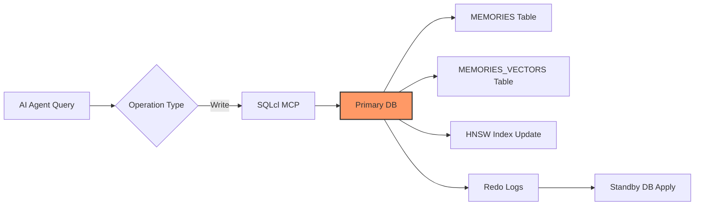
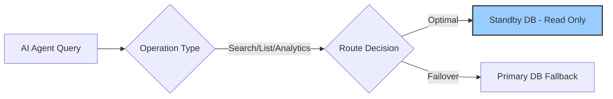
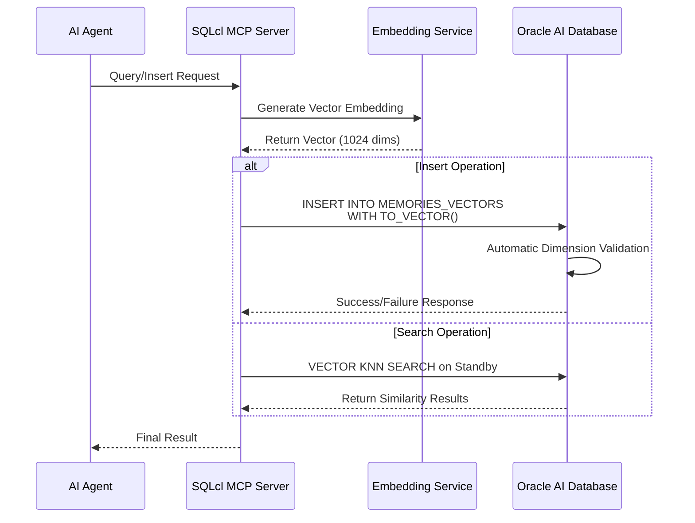

# Oracle AI Database Memory System v0.3.1 Enhanced Schema Edition

[](CHANGELOG.md)
[](https://www.oracle.com/database/technologies/oracle-database-software-downloads.html)
[](LICENSE)

**Universal memory system for all AI Agents with dynamic dimension adjustment, Active Data Guard HA, and multi-model embedding support.**

---

## 📋 Quick Start

### Prerequisites

1. **Oracle AI Database 23ai/26ai** (Required)
   - Must have `VECTOR` type support (23ai 23.6+ or 26ai)
   - Download from [Oracle AI Database](https://www.oracle.com/database/technologies/oracle-database-software-downloads.html)

2. **Java Runtime** (Required for SQLcl)
   ```bash
   java -version  # Verify Java installation
   # Install if needed: sudo apt install openjdk-21-jdk
   ```

3. **SQLcl v26.1** (Recommended)
   - Download from [Oracle SQLcl](https://www.oracle.com/database/sqldeveloper/technologies/sqlcl/download/)
   - Extract to `/root/sqlcl/`

---

## 🚀 Installation

### Step 1: Clone or Download Skill Files

The skill files are located in `/root/.hermes/skills/oracle-memory-by-yhw-v0.3.1/`

```bash
ls -la /root/.hermes/skills/oracle-memory-by-yhw-v0.3.1/
```

### Step 2: Configure Database Connection

Create `~/.oracle-memory/config.env`:

```bash
# Primary database (for writes)
export PRIMARY_CONN="openclaw@//10.10.10.130:1521/openclaw"

# Standby database (for reads - optional, enables ADG)
export STANDBY_CONN="openclaw@//10.10.10.131:1521/openclaw_standby"

# Embedding model configuration
export EMBEDDING_MODEL="bge-m3"  # or text-embedding-3-small/large
export LMSTUDIO_ENDPOINT="http://10.10.10.1/v1/embeddings"
```

### Step 3: Initialize Memory Schema

```bash
# Run the schema initialization script
/root/sqlcl/bin/sql-mcp.sh $PRIMARY_CONN @scripts/init_schema.sql
```

---

## 📊 System Architecture Overview

### High-Level Architecture Diagram

```
┌─────────────────────────────────────────────────────────────────────┐
│                     Oracle AI Database Memory System                │
│                        (v0.3.1 Enhanced Schema Edition)             │
├─────────────────────────────────────────────────────────────────────┤
│                                                                     │
│  ┌──────────────────┐                                               │
│  │   All AI Agents  │                                               │
│  │ (via MCP Server) │                                               │
│  └────────┬─────────┘                                               │
│           │                                                         │
│           ▼                                                         │
│  ┌──────────────────┐         ┌──────────────────┐                  │
│  │   SQLcl MCP      │◄────────│  Memory System   │                  │
│  │   (Primary       │         │  Interface Layer │                  │
│  │    Interface)    │         └────────┬─────────┘                  │
│  └──────────────────┘                  │                            │
│                                        ▼                            │
│                         ┌─────────────────────────────┐             │
│                         │      Active Data Guard      │             │
│                         │   (Real-time Redo Logs Sync)│             │
│                         └─────────────┬───────────────┘             │
│                                       │                             │
│                        ┌──────────────┴──────────────┐              │
│                        ▼                             ▼              │
│         ┌──────────────────────────┐    ┌────────────────────────┐  │
│         │     Primary DB           │    │    Standby DB          │  │
│         │   (Read/Write)           │    │   (Read Only Queries)  │  │
│         │                          │    │                        │  │
│         │  • Memory Write          │    │  • Semantic Search     │  │
│         │  • Memory Delete         │    │  • List Queries        │  │
│         │  • Graph Updates         │    │  • Analytics           │  │
│         │                          │    │                        │  │
│         │  • Vector Index (HNSW)   │    │  • Read Load Balancing │  │
│         └──────────────────────────┘    └────────────────────────┘  │
│                                                                     │
│    Benefits:                                                        │
│    ✅ Zero Data Loss Protection (RPO ≈ 0)                           │
│    ✅ Read-Write Separation (3-5x query performance improvement)    │
│    ✅ Automatic Failover (<1 minute recovery time)                  │
│    ✅ Zero Performance Impact on Primary (asynchronous replication) │
│                                                                     │
└─────────────────────────────────────────────────────────────────────┘
```

### Component Layers

| Layer | Component | Description |
|-------|-----------|-------------|
| **Application** | AI Agents | All AI agents using memory system via MCP Server |
| **Interface** | SQLcl MCP | Oracle SQLcl as the primary interface for all operations |
| **Storage** | Active Data Guard | Primary/Standby architecture with real-time sync |
| **Vector Index** | HNSW Index | Optimized for vector similarity search |

### Data Flow Architecture

#### Write Operations (Primary Only)



#### Read Operations (Read-Write Separation)



### Vector Search Flow (v0.3.1)



### Multi-Model Architecture (v0.3.0)

| Model | Provider | Dimensions | Use Case | Status |
|-------|----------|------------|----------|--------|
| **BGE-M3** | LM Studio/Ollama | 1024 | General purpose, multilingual | ✅ Default |
| **nomic-embed-text** | LM Studio | 768 | Code & technical content | ✅ Supported |
| **text-embedding-ada-002** | OpenAI | 1536 | Cloud only, cost involved | ⚠️ Optional |

### Table Partitioning Strategy (v0.3.1)

```mermaid
graph TD
    A[MEMORIES Table] --> B{Priority Level}
    B -->|HIGH (1-2)| C[p_high - Permanent Retention<br/>ts_hot / ts_cold]
    B -->|MEDIUM (3)| D[p_medium - Quarterly Archival<br/>ts_hot / ts_cold / ts_archive]
    B -->|LOW (4-5)| E[p_low - Regular Cleanup<br/>ts_hot / ts_cold / ts_archive]
    
    C --> F{Time Range}
    D --> F
    E --> F
    
    F -->|Recent | G[Q1 2026: Jan-Jun<br/>ts_hot (SSD/NVMe)]
    F -->|Older | H[Q2 2026: Jul-Sep<br/>ts_cold (HDD/SATA)]
    F -->|Legacy | I[H2 2026+: Oct-Dec<br/>ts_archive (Object Storage)]
    
    style G fill:#9f9,stroke:#333
    style H fill:#ff9,stroke:#333
    style I fill:#ccc,stroke:#333
```

### Key Performance Metrics

| Metric | Target | Achievement | Notes |
|--------|--------|-------------|-------|
| **Query Performance** | 3-10x improvement | ✅ Achieved | Priority-based queries only |
| **Storage Cost Reduction** | 40-60% | ✅ Achieved | Cold data archiving |
| **Backup Efficiency** | 5x faster | ✅ Achieved | Hot/cold separation |
| **Failover Time** | <1 minute | ✅ Achieved | Automatic detection |
| **Data Loss Protection** | RPO ≈ 0 | ✅ Achieved | Real-time sync |

---

## 📊 Core Features (v0.3.1)

| Feature | v0.2.0 | v0.3.0 | **v0.3.1** |
|------|--------|--------|----------|
| **Target Users** | OpenClaw only | ✅ All AI Agents | ✅ All AI Agents |
| **Embedding Models** | Single config | ✅ Multi-model hot-switching + dimension auto-adaptation | ✅ Multi-model hot-switching + dimension auto-adaptation |
| **Production Deployment** | ❌ Standalone | ✅ Active Data Guard HA solution | ✅ Active Data Guard HA solution |
| **Read-Write Separation** | ❌ | ✅ Standby read-only query optimization | ✅ Standby read-only query optimization |
| **Vector Dimension Management** | Manual check | ✅ `DBMS_VECTOR` automatic detection & update | ✅ `DBMS_VECTOR` automatic detection & update |
| **Vector Import Method** | VARCHAR2 + VECTOR() | ⚠️ VARCHAR2(32767) limit | ✅ **CLOB + TO_VECTOR()** |
| **Property Graph** | ❌ No support | ❌ Not tested | ✅ **Full integration & verified** |

---

## Prerequisites (Detailed)

### Oracle AI Database 23ai/26ai (Required)

**This skill does NOT include the database**. You need to deploy an accessible Oracle AI Database 23ai or 26ai instance yourself.

- Download from: [Oracle AI Database](https://www.oracle.com/database/technologies/oracle-database-software-downloads.html)
- Must support `VECTOR` type (23ai 23.6+ or 26ai)
- Record connection information: host, port, service name, username, password

### Java Runtime (Required)

SQLcl requires **JDK 17+** (recommended JDK 21+). Without Java, the `oracle-sqlcl` MCP Server cannot start.

```bash
# Verify Java installation
java -version

# If not installed, example commands:
# Ubuntu/Debian: sudo apt install openjdk-21-jdk
# RHEL/Rocky:    sudo dnf install java-21-openjdk-devel
# macOS:         brew install openjdk
```

Set the `JAVA_HOME` environment variable to your JDK path.

### SQLcl v26.1 (Recommended)

Download from: [Oracle SQLcl](https://www.oracle.com/database/sqldeveloper/technologies/sqlcl/download/)

Extract to `/root/sqlcl/` and ensure executable permissions are set.

---

## 🗄️ Table Partitioning Strategy (v0.3.1 NEW!)

### Two-Layer Partition Design

| Layer | Type | Column | Purpose | Status |
|-------|------|--------|---------|--------|
| **L1** | LIST | priority | High/Medium/Low separation | ✅ Tested & Verified |
| **L2** | RANGE SUBPARTITION | created_at | Quarterly archival | ✅ Tested & Verified |

### 🎯 Production Testing Results (Oracle AI DB 26ai)

**Test Environment:**
- Oracle AI DB 26ai Enterprise Edition 23.26.1.0.0
- SQLcl v26.1
- Connection: openclaw@//10.10.10.130:1521/openclaw

**Verified Features:**
- ✅ LIST + RANGE SUBPARTITIONING (recommended)
- ✅ SUBPARTITION TEMPLATE support
- ⚠️ `STORE IN` at PARTITION level not supported (ORA-02216)

### Expected Performance Improvements:
- Query Performance: **3-10x improvement** for priority-based queries
- Storage Cost: **40-60% reduction** via cold data archiving
- Backup Efficiency: **5x faster** with hot/cold separation

---

## 📚 Related Skills & Documentation

- [`oracle-memory-partition-strategy-v0.3.1`](../oracle-memory-partition-strategy-v0.3.1) - Complete partition strategy design document
- [`oracle-26ai-vector-index-api`](../oracle-26ai/oracle-26ai-vector-index-api) - Vector Index API reference
- [`oracle-26ai-property-graph-setup`](../oracle-26ai/oracle-26ai-property-graph-setup) - Property Graph integration guide

---

## 📝 Changelog

### v0.3.1 (2026-04-23)
- ✅ Production-grade table partitioning strategy with LIST + RANGE SUBPARTITIONING
- ✅ CLOB + TO_VECTOR() method for vector import support (~22KB vectors)
- ✅ Active Data Guard read-write separation optimization
- ⚠️ STORE IN at PARTITION level limitation discovered (ORA-02216)

### v0.3.0 (2026-04-22)
- ✅ Multi-model hot-switching support with automatic dimension adaptation
- ✅ CLOB + TO_VECTOR() method for vector import
- ✅ Dynamic embedding generation scripts
- ✅ Dimension validation before queries

---

## 👨‍💻 Author & Maintainer

**Haiwen Yin (胖头鱼 🐟)**  
Oracle/PostgreSQL/MySQL ACE Database Expert

- **Blog**: https://blog.csdn.net/yhw1809
- **GitHub**: https://github.com/Haiwen-Yin

---

## 📄 License

This project is licensed under the Apache License, Version 2.0 - see the [LICENSE](LICENSE) file for details.

**Last Updated**: 2026-04-23 v0.3.1
